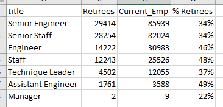
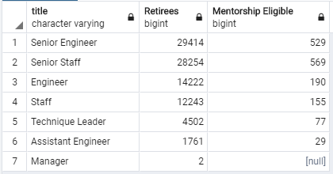

# Pewlett Hackard Analysis
## Purpose
Create tables with information on employees who will be retiring soon as well as employees who are eligible to serve as mentors for new employees.  

## Results
### Number of Retiring Employees by Title
[Retirees by Title File](./Data/retiring_titles.csv)  
#### Percent Retirees by Title  

* A large percentage of each employees of each title will be retiring.
* The majority of the retirees (64%) are Senior Engineers or Senior Staff.
* Only 2 of the retirees hold a Manager title.
* Engineers and Staff titles are 30% of the retirees.
  
### Employees Eligible for the Mentorship Program
[Mentorship Eligibility File](./Data/mentorship_eligibility.csv)  
#### Retirees vs. Mentorship Eligible Employees by Title  

  
* Employees eligible for menotrship were born in the year 1965.
* There are many more employees retiring than those eligible for the mentorship program.
  
## Summary
1. How many roles will need to be filled as the "silver tsunami" begins to make an impact?  
   There will be over 90k roles needing to be filled once all of the retirees have left.
2. Are there enough qualified, retirement-ready employees in the departments to mentor the next generation of Pewlett Hackard employees?  
Based on the number of retiring employees, there will be plenty to mentor the employees eligible for the mentorship program.
